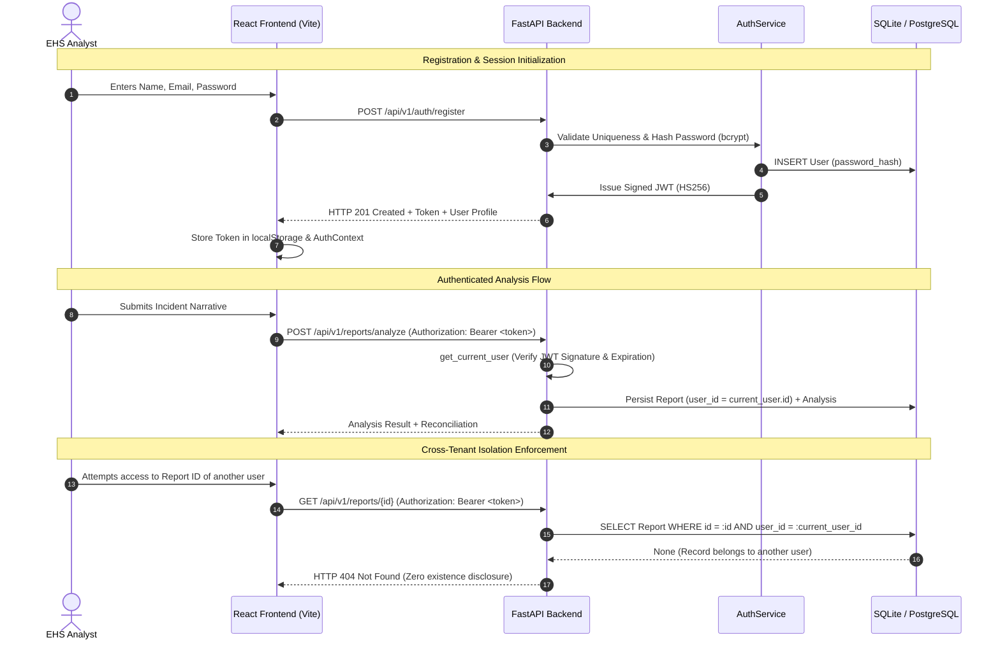

# Phase 9.4 — Authentication & User Ownership Specification

## 1. Executive Summary & Architectural Overview

The **SIH26165 Serious Injury & Fatality (SIF) Precursor Detection Platform** has been expanded to support enterprise-grade **Authentication & Multi-Tenant User Ownership**. 

All incident analyses, history logs, and dashboard analytics are now bound strictly to authenticated user accounts. Multi-tenancy is enforced at the database and service layers, guaranteeing zero information leakage across user boundaries while preserving the integrity of the completely frozen core intelligence layer.

### System Invariants Preserved
* **Frozen SIF Pipeline**: Core rule engine (`sif_auto_annotator_v23.py`), ML model artifact (`tfidf_logistic_regression.joblib`), threshold ($\tau = 0.59$), and reconciliation matrix (`sif_reconciliation_engine.py`) remain completely untouched.
* **Metadata Quarantine**: Prohibited outcome metadata (fatalities, hospitalizations, amputations) remain 100% quarantined and cannot be stored or submitted.
* **Deterministic Isolation**: Every database operation on reports, analyses, and metrics requires and filters by the authenticated user's ID.

---

## 2. Authentication Architecture

---

## 3. Security Design & Cryptographic Standards

| Security Requirement | Implementation Standard | Defense Objective |
|---|---|---|
| **Password Storage** | `bcrypt` with automatic salt generation (`gensalt`) | Prevents dictionary, rainbow table, and offline brute-force attacks. |
| **Session Integrity** | `PyJWT` signed with `HS256` secret key | Stateless token authorization with subject (`sub`) and expiration (`exp`). |
| **Enumeration Prevention** | Uniform HTTP 401 for bad emails and bad passwords | Generic message: `"Invalid email address or password"` prevents user enumeration. |
| **Information Leakage** | HTTP 404 on cross-user resource lookup | Prevents attackers from confirming the existence of competitor/peer incident IDs. |
| **Secret Management** | Environment variable `JWT_SECRET_KEY` + `.gitignore` exclusions | Zero secrets committed to version control; safe defaults provided for dev only. |
| **Automated Log Scrubbing** | Passwords omitted from models, logs, and responses | Plaintext passwords are never persisted, printed, or serialized in traces. |

---

## 4. API Endpoints

### 4.1 Public Endpoints
* `GET /api/v1/health`: System health and status.
* `POST /api/v1/auth/register`: Creates new user account, hashes password, returns JWT token.
* `POST /api/v1/auth/login`: Authenticates credentials, returns signed JWT access token.
* `GET /docs` & `GET /redoc`: Interactive OpenAPI documentation.

### 4.2 Protected Endpoints (Require `Authorization: Bearer <token>`)
* `GET /api/v1/auth/me`: Retrieves current authenticated user profile.
* `POST /api/v1/reports/analyze`: Analyzes incident narrative, binds report to `current_user.id`.
* `GET /api/v1/reports`: Retrieves chronological history of reports belonging to `current_user.id`.
* `GET /api/v1/reports/{id}`: Retrieves report and audit details only if `report.user_id == current_user.id` (returns 404 otherwise).
* `GET /api/v1/dashboard/stats`: Computes summary analytics strictly for `current_user.id`.
* `GET /api/v1/dashboard/recent`: Retrieves recent activity stream strictly for `current_user.id`.

---

## 5. Frontend Authentication Integration

### Key Frontend Components
1. **`AuthContext` (`frontend/src/context/AuthContext.tsx`)**:
   - Manages state: `user`, `token`, `isAuthenticated`, `isLoading`.
   - Exposes `login()`, `register()`, `logout()`.
   - Checks existing session on startup via `/auth/me`.
   - Responds to `auth:unauthorized` window event by purging session.

2. **`apiClient` Interceptors (`frontend/src/services/api.ts`)**:
   - **Request Interceptor**: Extracts JWT token from `localStorage` (`sif_access_token`) and injects `Authorization: Bearer <token>`.
   - **Response Interceptor**: Dispatches `auth:unauthorized` upon encountering 401 from protected routes (excluding login/register).

3. **`ProtectedRoute` (`frontend/src/components/ProtectedRoute.tsx`)**:
   - Renders animated security session loader during token validation.
   - Redirects unauthenticated traffic to `/login` with return destination preserved.
   - Grants access to nested application routes upon session verification.

4. **User Interface Pages**:
   - **Login (`frontend/src/pages/Login.tsx`)**: Form validation, error callouts, and redirect.
   - **Register (`frontend/src/pages/Register.tsx`)**: Input sanitation, password match check, min-8-character enforcement.
   - **Sidebar (`frontend/src/components/Sidebar.tsx`)**: Displays user avatar badge, full name, email, and one-click Sign Out action.

---

## 6. Verification & Test Results

### 6.1 Automated Test Execution Summary
* **Python Backend Tests**: 369 passing (23 backend unit & integration tests + 346 pipeline/ML baseline tests).
* **Frontend Tests**: 24 passing across 7 test suites (`Login`, `Register`, `ProtectedRoute`, `Analyze`, `Dashboard`, `History`, `ReportDetail`).
* **Total Passing Tests**: **393 automated tests** passing with 0 failures.
* **Production Build**: `tsc && vite build` passing cleanly.

### 6.2 Multi-User End-to-End Live Verification
A live multi-tenant verification script was executed against the running FastAPI service:
1. **Public Health**: Verified HTTP 200 OK without authorization.
2. **Unauthenticated Access Protection**: Checked 5 protected routes; all 5 strictly failed with HTTP 401.
3. **User A Registration**: Registered `analyst_a@company.com` and received valid JWT token.
4. **Duplicate Rejection**: Re-registered `analyst_a@company.com`; received HTTP 409 Conflict.
5. **Brute-Force / Enumeration Protection**: Submitted invalid password; received generic HTTP 401.
6. **User A Login & /auth/me**: Logged in successfully and verified profile claims.
7. **User B Registration**: Registered `analyst_b@company.com` with isolated identity.
8. **Report Isolation**: User A submitted Report 1; Report 1 appeared in User A history, completely absent from User B history.
9. **Cross-Tenant ID Access**: User B requested User A's Report 1 by ID and received HTTP 404 Not Found.
10. **Symmetric Isolation**: User B submitted Report 2; User A requested Report 2 by ID and received HTTP 404 Not Found.
11. **Dashboard Stats Partitioning**: User A dashboard showed 1 report (SIF); User B dashboard showed 1 report (Non-SIF).

